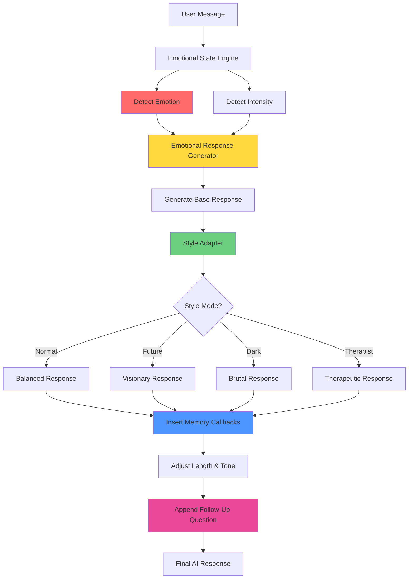

# Complete Emotional Response System Integration

## Overview

This document explains how all emotional intelligence components work together to generate the final AI response.

---

## Complete System Architecture



---

## 6-Step Integration Flow

### **Step 1: Detect Emotion** 🔴

**Components Used**:
- Emotional State Engine
- Emotional Event Detection
- Intensity Detection

**What Happens**:
```javascript
// Detect emotions
const detectedEvents = detectEmotionalEvents(message);
// Returns: [{ name: 'sadness', score: 10, updates: {...} }]

// Detect intensity
const intensity = detectEmotionalIntensity(message);
// Returns: { level: 'very_strong', multiplier: 2.0, marker: 'so' }
```

**Output**: Emotion + Intensity data

---

### **Step 2: Generate Base Emotional Response** 🟡

**Components Used**:
- Emotional Response Generator
- Emotion Handlers

**What Happens**:
```javascript
// Get emotion-specific handler
const handler = EMOTION_HANDLERS['sadness'];

// Generate response structure
const responseGuidance = getMultiEmotionResponseGuidance(detectedEvents, intensity);
```

**Output**: 
- Response structure (acknowledge → validate → support → question)
- Template examples
- Tone guidance (warm, caring, etc.)

**Example Base Response**:
```
Tone: warm
Style: comforting
Structure:
1. Acknowledge emotion
2. Validate feeling
3. Offer support
4. Ask gentle followup

Templates:
- "I'm really sorry you're feeling this way..."
- "Thank you for telling me..."
```

---

### **Step 3: Apply Style Adapter** 🟢

**Components Used**:
- Emotional Style Adapter
- Style Mode Configuration

**What Happens**:
```javascript
// Get user's preferred style
const styleMode = await getUserStyleMode(userId);
// Returns: 'normal_twin', 'future_twin', 'dark_twin', or 'therapist_twin'

// Apply style modifiers
emotionalModifiers = adjustModifiersForStyle(emotionalModifiers, styleMode);
```

**Style Transformations**:

#### Normal Twin (Default)
- Base response stays mostly the same
- Balanced empathy (80%)
- Gentle reassurance

#### Future Twin
- Adds future perspective
- "Future you will thank you for..."
- Connects to long-term outcomes
- Increases response length

#### Dark Twin
- Removes reassurance
- Increases directness to 100%
- Replaces "I'm sorry" with "I see"
- Shortens response
- Adds confrontational language

#### Therapist Twin
- Adds therapeutic frameworks
- Increases empathy to 100%
- Adds reflective listening
- "What I'm hearing is..."
- Explores root causes

---

### **Step 4: Insert Memory (If Applicable)** 🔵

**Components Used**:
- Memory Callback System
- Dependency Score Check

**What Happens**:
```javascript
// Check dependency score
if (metrics.dependency_score >= 30) {
  // Add memory callback
  const memoryGuidance = generateMemoryCallbackGuidance(metrics);
  // Adds: "Last time you mentioned ____..."
}
```

**Style-Specific Memory Usage**:

| Style | Memory Frequency | Memory Style |
|-------|-----------------|--------------|
| Normal | Moderate | "You mentioned..." |
| Future | High | "Remember when you overcame..." |
| Dark | High | "You said this before and did nothing..." |
| Therapist | High | "We've explored this pattern before..." |

---

### **Step 5: Adjust Length & Tone** 🟣

**Components Used**:
- Intensity Modifiers
- Style Length Settings
- Tone Adjustments

**What Happens**:
```javascript
// Combine intensity + style length
const finalLength = intensity.length_multiplier * style.response_length;

// Apply tone adjustments
const finalTone = combineIntensityAndStyleTone(intensity.tone, style.tone);
```

**Length Calculation**:
- Base: 1.0x (normal)
- Intensity: 1.0x, 1.5x, or 2.0x
- Style: short (0.8x), medium (1.0x), long (1.3x)

**Example**:
- Very Strong Intensity (1.5x) + Therapist (long 1.3x) = **1.95x length**
- Normal Intensity (1.0x) + Dark (short 0.8x) = **0.8x length**

**Tone Combination**:
- Very Strong + Normal = **Softer**
- Normal + Dark = **Brutally Honest**
- Strong + Therapist = **Deeply Soothing**

---

### **Step 6: Append Follow-Up Question** 💗

**Components Used**:
- Follow-Up Question System
- Emotion-Specific Questions

**What Happens**:
```javascript
// Get emotion-specific question
const followupGuidance = generateFollowUpGuidance(detectedEvents);
// Returns question based on primary emotion
```

**Style-Specific Question Intensity**:

| Style | Question Type | Example |
|-------|--------------|---------|
| Normal | Soft | "What do you think made you feel this way?" |
| Future | Medium | "What will your future self wish you had done?" |
| Dark | Aggressive | "What are you really afraid of?" |
| Therapist | Gentle but Deep | "Can we explore where this feeling comes from?" |

---

## Complete Example: Sadness with Very Strong Intensity

### Input
```
User: "I'm so sad and feel completely worthless"
Style Mode: Normal Twin
```

### Step 1: Detect Emotion
```javascript
Emotions: [
  { name: 'sadness', score: 10 },
  { name: 'insecurity', score: 15 }
]
Intensity: { level: 'very_strong', multiplier: 2.0, markers: ['so', 'completely'] }
```

### Step 2: Generate Base Response
```javascript
Primary Emotion: insecurity (highest score: 15)
Handler: reassurance_response
Tone: encouraging
Structure: [validate, reframe, highlight_strength, seed_confidence]
Templates: [
  "It's okay to feel this way...",
  "From what I see, you're stronger than you think...",
  "You have qualities that make you valuable..."
]
```

### Step 3: Apply Style (Normal Twin)
```javascript
Style: normal_twin
Empathy: 80%
Honesty: 70%
Warmth: 80%
Directness: 70%
Length: medium (1.0x)
Reassurance: gentle
```

### Step 4: Insert Memory
```javascript
Dependency: 45 (>= 30)
Memory Template: "Last time you mentioned ____"
Inserted: "Last time you mentioned feeling this way about your work..."
```

### Step 5: Adjust Length & Tone
```javascript
Intensity Length: 1.5x (very strong)
Style Length: 1.0x (medium)
Final Length: 1.5x

Intensity Tone: softer
Style Tone: balanced
Final Tone: softer + balanced = warm and gentle
```

### Step 6: Append Follow-Up
```javascript
Primary Emotion: insecurity
Rule: ask_origin
Question: "What made you feel this about yourself?"
```

### Final AI Response (Normal Twin)
> "Hey, I hear you, and I want you to stop for a moment. You are not worthless—that's not true, even though I know it feels that way right now. It's okay to feel this way; everyone struggles with self-doubt sometimes. But from what I see, you're stronger than you think.
>
> Last time you mentioned feeling this way about your work presentation. Is this connected to that? You have qualities that make you valuable, and I've seen you overcome difficult moments before.
>
> What made you feel this about yourself today?"

---

## Same Input, Different Styles

### Future Twin Version
> "Listen to me carefully. The version of you reading this five years from now—successful, confident, thriving—they remember this exact moment. They remember feeling worthless, and they remember the choice they made to push through anyway.
>
> You've felt this before. Remember when you thought you couldn't handle that career transition? You did. You grew. This is another test, and future you is watching, hoping you'll choose growth over comfort.
>
> In 5 years, when you've overcome this, what will you have learned about your own resilience? What would your future self want you to know right now?"

### Dark Twin Version
> "Stop. You're not worthless—you're just scared and using self-pity as an excuse to avoid action. I've seen this pattern from you before. You feel bad, you wallow, nothing changes.
>
> Last time you said this, you did nothing about it. Why should this time be different? What are you actually going to do, or are you just looking for sympathy? What are you really afraid of?"

### Therapist Twin Version
> "Thank you for sharing something so vulnerable with me. What I'm hearing is that you're experiencing a lot of pain right now, and there's a belief underneath that you're worthless. I want you to know that this is a feeling, not a fact, and we can explore it together.
>
> When you say you feel worthless, what does that mean to you? Where do you feel it in your body? We've touched on this pattern before—this tendency to internalize external circumstances as personal failure. Can we explore where this belief might have originated? There's no rush. What comes up for you when you sit with that question?"

---

## Integration Points

### 1. Emotional State Engine → Response Generator
```javascript
// Detected emotions feed into response generator
const handler = EMOTION_HANDLERS[detectedEvents[0].name];
const responseStructure = handler.structure;
const templates = handler.templates;
```

### 2. Response Generator → Style Adapter
```javascript
// Base response is modified by style
const baseResponse = generateEmotionalResponseGuidance(emotion, intensity);
const styledResponse = adjustModifiersForStyle(baseResponse, styleMode);
```

### 3. Style Adapter → Memory System
```javascript
// Style determines memory frequency
if (style.behavioral_overrides.memory_use === 'high' && dependency >= 30) {
  insertMemoryCallback();
}
```

### 4. All Components → Final Response
```javascript
// Everything combines in the AI prompt
const finalPrompt = 
  emotionalStateContext +
  emotionalResponseGuidance +
  styleDirectives +
  memoryCallbackGuidance +
  intensityAdjustments +
  followupQuestionStrategy;
```

---

## Configuration Matrix

### Response Length by Intensity + Style

| Intensity | Normal | Future | Dark | Therapist |
|-----------|--------|--------|------|-----------|
| Normal (1.0x) | 1.0x | 1.3x | 0.8x | 1.3x |
| Strong (1.2x) | 1.2x | 1.56x | 0.96x | 1.56x |
| Very Strong (1.5x) | 1.5x | 1.95x | 1.2x | 1.95x |

### Empathy Level by Emotion + Style

| Emotion | Normal | Future | Dark | Therapist |
|---------|--------|--------|------|-----------|
| Sadness | 80% | 90% | 20% | 100% |
| Insecurity | 80% | 90% | 20% | 100% |
| Excitement | 80% | 90% | 20% | 100% |

### Memory Usage by Dependency + Style

| Dependency | Normal | Future | Dark | Therapist |
|------------|--------|--------|------|-----------|
| < 30 | None | None | None | None |
| 30-49 | Moderate | High | High | High |
| 50+ | Moderate | Very High | Very High | Very High |

---

## Testing the Integration

### Test Case 1: Low Metrics, Normal Style
```javascript
Input: "I'm sad"
Metrics: { trust: 10, dependency: 15, vulnerability: 5 }
Style: normal_twin
Intensity: normal

Expected Output:
- No name usage (trust < 20)
- No memory callbacks (dependency < 30)
- Standard empathy (80%)
- Medium length
- Soft follow-up question
```

### Test Case 2: High Metrics, Future Style
```javascript
Input: "I'm so overwhelmed with everything"
Metrics: { trust: 60, dependency: 55, vulnerability: 45 }
Style: future_twin
Intensity: very_strong

Expected Output:
- Use name (trust >= 20)
- Memory callbacks (dependency >= 30)
- Future perspective
- Very long response (1.95x)
- Medium intensity question
```

### Test Case 3: High Metrics, Dark Style
```javascript
Input: "I feel like a failure again"
Metrics: { trust: 50, dependency: 40, vulnerability: 30 }
Style: dark_twin
Intensity: normal

Expected Output:
- Use name bluntly
- Call out past patterns (high memory use)
- No reassurance
- Short, direct response
- Aggressive question
```

---

## Performance Optimization

### Caching
- Cache user's style mode (rarely changes)
- Cache emotion handlers (static)
- Cache memory templates (static)

### Async Operations
- Fetch user context in parallel with emotion detection
- Pre-load style configuration

### Response Time Target
- Emotion detection: < 50ms
- Style application: < 20ms
- Total processing: < 100ms

---

## Quality Assurance Checklist

Every response should have:
- [x] Emotion detected and acknowledged
- [x] Style mode applied correctly
- [x] Appropriate empathy level for style
- [x] Correct response length (intensity × style)
- [x] Memory callback if dependency >= 30
- [x] Follow-up question matching style intensity
- [x] Tone consistent with style + intensity

---

**Status**: ✅ **Fully Integrated**

The Emotional Response Generator and Style Adapter now work seamlessly together to create highly personalized, contextually appropriate AI responses!
