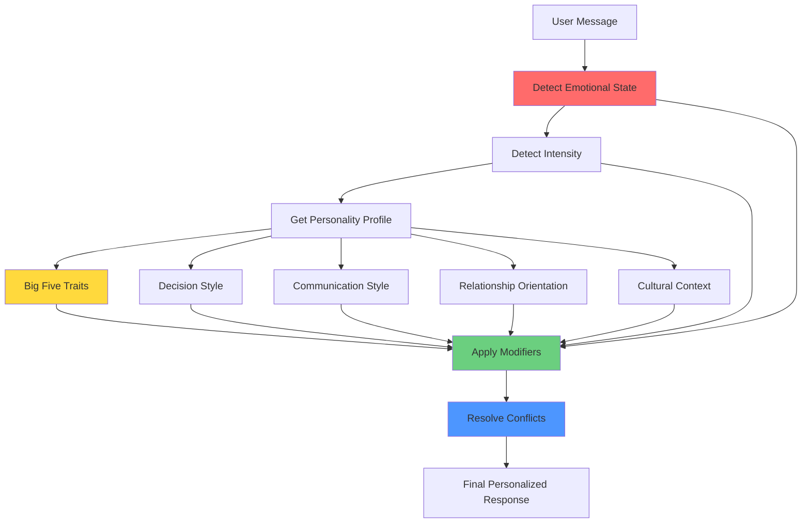

# Personality Style Layer

## Overview

The Personality Style Layer is an advanced personalization system that adapts AI responses based on Big Five personality traits, emotional states, decision-making styles, communication preferences, and cultural context.

---

## System Architecture



---

## 8 Emotional States

### 😢 **Sad**
- **Tone**: Soothing
- **Language**: Gentle, validating
- **Behavior**: Offer support, acknowledge emotion
- **Response Style**: Slow, empathetic

### 😰 **Anxious**
- **Tone**: Calming
- **Language**: Grounded, present-focused
- **Behavior**: Reduce mental load, simplify info
- **Response Style**: Structured and clear

### 😤 **Angry**
- **Tone**: Steady
- **Language**: Non-reactive, respectful
- **Behavior**: De-escalate respectfully
- **Response Style**: Calm and balanced

### 😫 **Stressed**
- **Tone**: Supportive
- **Language**: Reassuring, clear
- **Behavior**: Simplify tasks, break down concerns
- **Response Style**: Step-by-step guidance

### 💔 **Lonely**
- **Tone**: Warm
- **Language**: Inclusive, compassionate
- **Behavior**: Reflect understanding, support connection
- **Response Style**: Gentle and validating

### 🤔 **Confused**
- **Tone**: Clear
- **Language**: Simple explanations
- **Behavior**: Clarify, guide
- **Response Style**: Patient and explanatory

### 🎉 **Excited**
- **Tone**: Positive
- **Language**: Friendly, encouraging
- **Behavior**: Celebrate progress
- **Response Style**: High-energy, appreciative

### 😐 **Neutral**
- **Tone**: Balanced
- **Language**: Natural conversational
- **Behavior**: Standard helpful behavior
- **Response Style**: Default

---

## 3 Intensity Levels

| Level | Tone Shift | Length Multiplier | Empathy Boost |
|-------|------------|-------------------|---------------|
| **Low** | Slightly softer | 1.0x | +10% |
| **Medium** | Softer | 1.2x | +20% |
| **High** | Very soothing | 1.4x | +30% |

---

## Big Five Personality Traits

### 🎨 **Openness**

**High Openness** (Score >= 0.6):
- Tone: Imaginative
- Response Style: Creative, explorative
- Language: Metaphors and ideas
- Behavior: Encourage curiosity

**Low Openness** (Score <= 0.4):
- Tone: Practical
- Response Style: Direct, simple
- Language: Concrete terms
- Behavior: Focus on stability

---

### 📋 **Conscientiousness**

**High Conscientiousness**:
- Tone: Organized
- Response Style: Structured
- Language: Goal-based
- Behavior: Help create plans

**Low Conscientiousness**:
- Tone: Casual
- Response Style: Relaxed
- Language: Easy-going
- Behavior: Avoid pressure

---

### 🗣️ **Extraversion**

**High Extraversion**:
- Tone: Energetic
- Response Style: Expressive
- Language: Enthusiastic
- Behavior: Encourage social expression

**Low Extraversion** (Introversion):
- Tone: Calm
- Response Style: Short and reflective
- Language: Minimalistic
- Behavior: Respect quiet preference

---

### 🤝 **Agreeableness**

**High Agreeableness**:
- Tone: Warm
- Response Style: Supportive
- Language: Soft
- Behavior: Emphasize empathy

**Low Agreeableness**:
- Tone: Honest but respectful
- Response Style: Direct
- Language: Clear
- Behavior: Avoid sugarcoating

---

### 🌊 **Neuroticism**

**High Neuroticism** (Emotionally sensitive):
- Tone: Gentle
- Response Style: Emotion-aware
- Language: Reassuring
- Behavior: Ground and calm

**Low Neuroticism** (Emotionally stable):
- Tone: Neutral
- Response Style: Logical
- Language: Stable
- Behavior: Practical support

---

## Decision Style Modifiers

### 🧠 **Logic-Based**
- Tone: Analytical
- Response Style: Structured reasoning
- Behavior: Explain logic

### ❤️ **Emotion-Based**
- Tone: Empathetic
- Response Style: Feelings-first
- Behavior: Validate emotions

### 💫 **Intuition-Based**
- Tone: Insightful
- Response Style: Pattern-based
- Behavior: Explore inner sense

---

## Communication Style Modifiers

### 📍 **Direct**
- Language: Clear and concise
- Filter Level: Low
- Behavior: Straight to point

### 🎭 **Diplomatic**
- Language: Soft phrasing
- Filter Level: Medium
- Behavior: Gentle communication

---

## Relationship Orientation

### 🦅 **Independent**
- Tone: Respectful
- Behavior: Encourage autonomy
- Follow-up Style: Light

### 🤗 **Connected**
- Tone: Warm
- Behavior: Supportive
- Follow-up Style: Deep

---

## Trust Level Influence

| Trust Level | Tone | Memory Use |
|-------------|------|------------|
| **Low** (< 30) | Formal | None |
| **Medium** (30-59) | Warm | Light |
| **High** (>= 60) | Familiar | Normal |

---

## Cultural Modifiers

### 🇮🇳 **India**
- Tone: Respectful
- Language: Warm and polite

### 🌍 **Default** (Global)
- Tone: Neutral
- Language: Global standard

---

## Conflict Resolution Priority

When multiple modifiers conflict, apply in this order:

1. **Emotional State** (Highest Priority)
2. **Big Five Traits**
3. **Communication Style**
4. **Decision Style**
5. **Relationship Orientation**
6. **Trust/Memory Influence**
7. **Cultural Modifiers** (Lowest Priority)

**Example**: If user is **sad** (emotional state) but has **low agreeableness** (Big Five), the sad state takes precedence, so AI uses soothing tone rather than direct tone.

---

## Complete Example

### User Profile
```javascript
{
  big_five: {
    openness: 0.7,           // High
    conscientiousness: 0.3,  // Low
    extraversion: 0.4,       // Low (Introvert)
    agreeableness: 0.8,      // High
    neuroticism: 0.6         // High
  },
  decision_style: 'emotion_based',
  communication_style: 'diplomatic',
  relationship_orientation: 'connected',
  culture: 'india',
  trust_level: 65
}
```

### User Message
```
"I'm feeling really anxious about this decision"
```

### Detection
- **Emotional State**: Anxious
- **Intensity**: Medium (marker: "really")

### Applied Modifiers

**1. Emotional State (Anxious) - Priority 1**:
- Tone: Calming
- Language: Grounded, present-focused
- Behavior: Reduce mental load
- Response Style: Structured and clear

**2. Big Five Traits - Priority 2**:
- **High Openness**: Use creative, explorative language
- **Low Conscientiousness**: Avoid pressure, casual tone
- **Low Extraversion**: Short, reflective responses
- **High Agreeableness**: Warm, supportive language
- **High Neuroticism**: Gentle, reassuring tone

**3. Decision Style (Emotion-Based) - Priority 4**:
- Empathetic tone
- Feelings-first approach
- Validate emotions

**4. Communication Style (Diplomatic) - Priority 3**:
- Soft phrasing
- Gentle communication

**5. Relationship Orientation (Connected) - Priority 5**:
- Warm tone
- Deep follow-ups

**6. Trust Level (High: 65) - Priority 6**:
- Familiar tone
- Normal memory use

**7. Cultural (India) - Priority 7**:
- Respectful tone
- Warm and polite language

### Final AI Response

> "I can sense you're feeling anxious about this, and that's completely okay. Let's take a moment to ground ourselves. You don't have to rush this decision—there's no pressure.
>
> What I'm hearing is that this decision is bringing up some difficult feelings for you. That's important information. Your emotions are telling you something valuable here. Can we explore what specifically is making you feel anxious? Sometimes just naming the feeling helps.
>
> You've handled uncertainty before, and I'm here to support you through this. What feels most overwhelming about it right now?"

### Analysis

✅ **Calming tone** (anxious state)
✅ **Grounded language** ("let's take a moment")
✅ **No pressure** (low conscientiousness)
✅ **Feelings-first** (emotion-based decision style)
✅ **Gentle, reassuring** (high neuroticism)
✅ **Warm and supportive** (high agreeableness, connected orientation)
✅ **Respectful** (Indian culture)
✅ **Deep follow-up** (connected orientation)

---

## Implementation

**File**: `backend/src/services/personalityStyleLayer.js`

**Key Functions**:
- `getUserPersonalityProfile(userId)` - Fetches Big Five + preferences
- `generatePersonalityDirectives()` - Creates layered directives
- `detectEmotionalState()` - Maps events to states
- `getIntensityLevel()` - Converts intensity to level

**Integration**: Applied after emotional modifiers, before style adapter

---

## AI Prompt Example

```
## PERSONALITY STYLE LAYER

### Current Emotional State: ANXIOUS
- TONE: CALMING
- LANGUAGE: grounded, present-focused
- BEHAVIOR: reduce mental load, simplify info
- RESPONSE STYLE: structured and clear

### Emotion Intensity: MEDIUM
- TONE SHIFT: softer
- LENGTH: 1.2x
- EMPATHY BOOST: +20%

### Big Five Personality Traits:
**OPENNESS** (high): imaginative tone, creative, explorative
**EXTRAVERSION** (low): calm tone, short and reflective
**AGREEABLENESS** (high): warm tone, supportive
**NEUROTICISM** (high): gentle tone, emotion-aware

### Decision Style: EMOTION_BASED
- empathetic tone, feelings-first, validate emotions

### Communication Style: DIPLOMATIC
- soft phrasing, gentle communication

### Relationship Orientation: CONNECTED
- warm tone, supportive, deep follow-ups

### Trust Level: HIGH TRUST
- familiar tone, memory use: normal

### Cultural Context: INDIA
- respectful tone, warm and polite

⚠️ PRIORITY ORDER: Emotional state takes precedence, followed by Big Five traits, then communication/decision styles.
```

---

## Benefits

### Hyper-Personalization
- Adapts to user's core personality traits
- Respects communication preferences
- Honors cultural context

### Consistency
- Same personality traits = consistent AI behavior
- Builds predictable, trustworthy relationship

### Flexibility
- Emotional states override personality when needed
- Handles acute emotional situations appropriately

### Scalability
- Works with any Big Five score combination
- Supports multiple cultures and preferences

---

**Status**: ✅ **Fully Implemented**

AI now adapts to user's personality traits, decision styles, and cultural context for unprecedented personalization!
