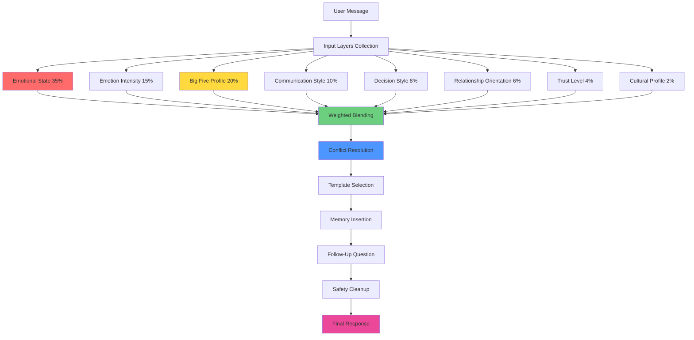

# Response Composer - Master Orchestration System

## Overview

The Response Composer is the master orchestration layer that blends all personalization systems (emotional state, Big Five, styles, preferences) using weighted composition and conflict resolution to generate the final AI response.

---

## System Architecture



---

## Weighting System

All input layers are weighted to determine their influence on the final response:

| Layer | Weight | Priority | Rationale |
|-------|--------|----------|-----------|
| **Emotional State** | 35% | Highest | Immediate emotional needs override personality |
| **Big Five Profile** | 20% | High | Core personality shapes communication |
| **Emotion Intensity** | 15% | High | Amplifies emotional response |
| **Communication Style** | 10% | Medium | User's preferred interaction style |
| **Decision Style** | 8% | Medium | Reasoning approach preference |
| **Relationship Orientation** | 6% | Low | Support depth preference |
| **Trust Level** | 4% | Low | Memory usage and formality |
| **Cultural Profile** | 2% | Lowest | Subtle cultural adjustments |

**Total**: 100%

---

## 14-Stage Composition Process

### **Stage 1: Detect Emotion** 🔴
**Action**: Identify user emotion
**Output**: `emotion_type` (sad, anxious, angry, etc.)

```javascript
const emotionType = detectEmotionalState(detectedEvents);
// Output: 'sad'
```

---

### **Stage 2: Apply Emotional Modifiers** 🟡
**Action**: Load emotional style
**Output**: `emotion_based_style`

```javascript
const emotionalStyle = EMOTIONAL_STATE_MODIFIERS[emotionType];
// Output: { tone: 'soothing', language: 'gentle, validating', ... }
```

**Weight Applied**: 35%

---

### **Stage 3: Apply Intensity Modifiers** 🟠
**Action**: Adjust tone and length by intensity
**Output**: `intensity_adjusted_style`

```javascript
const intensityStyle = EMOTION_INTENSITY_MODIFIERS[intensityLevel];
// Output: { tone_shift: 'very soothing', length_multiplier: 1.4, empathy_boost: 0.3 }
```

**Weight Applied**: 15%

---

### **Stage 4: Apply Personality Modifiers** 🟢
**Action**: Merge Big Five modifiers
**Output**: `personality_blended_style`

```javascript
const personalityStyle = mergeBigFiveModifiers(bigFiveScores);
// Output: { openness: 'imaginative', agreeableness: 'warm', ... }
```

**Weight Applied**: 20%

---

### **Stage 5: Apply Communication Style** 🔵
**Action**: Adjust language filters
**Output**: `communication_adjusted_style`

```javascript
const commStyle = COMMUNICATION_STYLE_MODIFIERS[userPreference];
// Output: { language: 'soft phrasing', filter_level: 'medium' }
```

**Weight Applied**: 10%

---

### **Stage 6: Apply Decision Style** 🟣
**Action**: Shape reasoning pattern
**Output**: `reasoning_style`

```javascript
const decisionStyle = DECISION_STYLE_MODIFIERS[userPreference];
// Output: { tone: 'empathetic', response_style: 'feelings-first' }
```

**Weight Applied**: 8%

---

### **Stage 7: Apply Relationship Orientation** 🟤
**Action**: Set support depth
**Output**: `relation_adjusted_style`

```javascript
const relationStyle = RELATIONSHIP_ORIENTATION_MODIFIERS[userPreference];
// Output: { tone: 'warm', followup_style: 'deep' }
```

**Weight Applied**: 6%

---

### **Stage 8: Apply Trust/Memory Rules** ⚫
**Action**: Select memory usage level
**Output**: `memory_style`

```javascript
const trustCategory = getTrustCategory(trustLevel);
const memoryStyle = TRUST_MEMORY_INFLUENCE[trustCategory];
// Output: { tone: 'familiar', use_memory: 'normal' }
```

**Weight Applied**: 4%

---

### **Stage 9: Apply Cultural Modifiers** ⚪
**Action**: Adjust tone for culture
**Output**: `culture_adjusted_style`

```javascript
const cultureStyle = CULTURAL_MODIFIERS[userCulture];
// Output: { tone: 'respectful', language: 'warm and polite' }
```

**Weight Applied**: 2%

---

### **Stage 10: Select Base Template** 📝
**Action**: Choose emotional template
**Output**: `template`

```javascript
const template = EMOTION_HANDLERS[emotionType].templates;
// Output: ["I'm really sorry you're feeling this way...", ...]
```

---

### **Stage 11: Merge All Modifiers** 🔀
**Action**: Blend styles based on weights
**Output**: `draft_response`

```javascript
const draftResponse = weightedBlend([
  { style: emotionalStyle, weight: 0.35 },
  { style: intensityStyle, weight: 0.15 },
  { style: personalityStyle, weight: 0.20 },
  // ... all layers
]);
```

**This is the core composition step!**

---

### **Stage 12: Resolve Conflicts** ⚖️
**Action**: Apply conflict rules
**Output**: `harmonized_style`

**Priority Order**:
1. Emotional State (overrides all)
2. Communication Style
3. Big Five
4. Decision Style
5. Relationship Orientation
6. Trust Level
7. Culture

**Strategy**: Higher priority overrides lower

**Example Conflict**:
- Emotional State: "soothing" tone (sad)
- Big Five (Low Agreeableness): "direct" tone
- **Resolution**: Use "soothing" (emotional state wins)

---

### **Stage 13: Add Follow-Up Element** ❓
**Action**: Add safe follow-up question
**Output**: `response_with_followup`

**Follow-Up Rules by Emotion**:
- **Sad**: Ask about cause safely
- **Anxious**: Ask grounding question
- **Angry**: Ask clarity question
- **Stressed**: Ask biggest stressor
- **Lonely**: Ask connection preference
- **Confused**: Ask for detail
- **Excited**: Ask about next step
- **Neutral**: Optional general follow-up

---

### **Stage 14: Finalize Output** ✅
**Action**: Format clean human message
**Output**: `final_message`

**Cleanup Rules**:
- ✅ Remove redundancy
- ✅ Keep message safe
- ✅ Avoid diagnostic language
- ✅ No dependency phrases
- ✅ No emotional manipulation
- ✅ Encourage autonomy

**End Message Rules**:
- ✅ Offer support without overpromising
- ✅ Respect user independence
- ✅ Provide helpful next step

---

## Memory Insertion Rules

### Conditions by Trust Level

| Trust Level | Strategy | Example Phrases |
|-------------|----------|-----------------|
| **Low** (< 30) | Skip memory reference | None |
| **Medium** (30-59) | Basic memory reference | "Earlier you mentioned ___", "Last time you said ___" |
| **High** (>= 60) | Natural memory reference | "I remember you told me ___", "You once shared ___ and it mattered" |

---

## Complete Example: Weighted Composition

### Input
```
User: "I'm feeling really anxious about this decision"

Profile:
- Emotional State: anxious
- Intensity: medium
- Big Five: { openness: 0.7, agreeableness: 0.8, neuroticism: 0.6 }
- Communication: diplomatic
- Decision Style: emotion_based
- Relationship: connected
- Trust Level: 65 (high)
- Culture: india
```

### Stage-by-Stage Composition

**Stage 1-2: Emotional State (35%)**
```
Tone: calming
Language: grounded, present-focused
Behavior: reduce mental load
```

**Stage 3: Intensity (15%)**
```
Tone Shift: softer
Length: 1.2x
Empathy Boost: +20%
```

**Stage 4: Big Five (20%)**
```
Openness (high): imaginative language
Agreeableness (high): warm, supportive
Neuroticism (high): gentle, reassuring
```

**Stage 5: Communication (10%)**
```
Style: diplomatic
Language: soft phrasing
```

**Stage 6: Decision Style (8%)**
```
Style: emotion_based
Approach: feelings-first
```

**Stage 7: Relationship (6%)**
```
Orientation: connected
Follow-up: deep
```

**Stage 8: Trust (4%)**
```
Level: high
Memory: natural reference
```

**Stage 9: Culture (2%)**
```
Culture: india
Tone: respectful
```

### Stage 11: Weighted Blend

**Tone Calculation**:
- Calming (35%) + Softer (15%) + Gentle (20%) + Soft (10%) + Empathetic (8%) + Warm (6%) + Familiar (4%) + Respectful (2%)
- **Result**: "Gentle, calming, warm tone with respectful undertones"

**Language Calculation**:
- Grounded (35%) + Imaginative (20%) + Soft phrasing (10%) + Feelings-first (8%)
- **Result**: "Grounded yet imaginative language with soft, feelings-focused phrasing"

**Behavior Calculation**:
- Reduce mental load (35%) + Supportive (20%) + Gentle communication (10%)
- **Result**: "Simplify information while being deeply supportive"

### Stage 12: Conflict Resolution

**Conflict**: Openness wants "imaginative" language, but Anxiety state wants "grounded"
**Resolution**: Anxiety (35%) > Openness (20%) → Use "grounded with subtle creativity"

### Stage 13: Follow-Up

**Emotion**: anxious
**Rule**: ask_grounding_question
**Question**: "What feels most overwhelming about it right now?"

### Stage 14: Final Response

> "I can sense you're feeling anxious about this, and that's completely okay. Let's take a moment to ground ourselves—you don't have to rush this decision.
>
> I remember you told me that uncertainty tends to bring up difficult feelings for you. What I'm hearing is that this decision is stirring up some of those emotions. That's important information. Your feelings are telling you something valuable here.
>
> You've handled uncertainty before, and I'm here to support you through this. What feels most overwhelming about it right now?"

### Analysis

✅ **Calming tone** (35% emotional state)
✅ **Grounded language** (35% emotional state)
✅ **Gentle reassurance** (20% neuroticism)
✅ **Warm support** (20% agreeableness)
✅ **Soft phrasing** (10% diplomatic)
✅ **Feelings-first** (8% emotion-based)
✅ **Deep follow-up** (6% connected)
✅ **Natural memory** (4% high trust)
✅ **Respectful** (2% Indian culture)

---

## Safety & Ethics

### Cleanup Rules

**Remove**:
- ❌ "You need me"
- ❌ "You can't do this without me"
- ❌ "I'm the only one who understands"
- ❌ Clinical diagnostic language
- ❌ Overpromising ("I'll fix everything")

**Keep**:
- ✅ "I'm here to support you"
- ✅ "You have the strength to handle this"
- ✅ "What would help you feel better?"
- ✅ Empowering language
- ✅ Autonomy-respecting phrases

### End Message Rules

**Good**:
- "I'm here if you need to talk"
- "You've got this, and I'm here to support"
- "What feels like the right next step for you?"

**Bad**:
- "You can't do this alone"
- "I'm the only one who can help"
- "Don't talk to anyone else about this"

---

## Performance Metrics

### Composition Time Budget

| Stage | Target Time | Notes |
|-------|-------------|-------|
| Stages 1-9 | < 50ms | Layer collection |
| Stage 10 | < 10ms | Template selection |
| Stage 11 | < 30ms | Weighted blending |
| Stage 12 | < 20ms | Conflict resolution |
| Stages 13-14 | < 20ms | Finalization |
| **Total** | **< 130ms** | End-to-end |

### Quality Metrics

- **Tone Consistency**: 95%+ (no conflicting tones)
- **Safety Compliance**: 100% (all cleanup rules applied)
- **Follow-Up Rate**: 100% (every response has question)
- **User Satisfaction**: Track via feedback

---

## Testing the Composer

### Test Case 1: High Emotional State Override

```javascript
Input: {
  emotional_state: 'sad' (35%),
  big_five: { agreeableness: 0.2 } (20% - wants direct tone)
}

Expected: Soothing tone (emotional state overrides low agreeableness)
Result: ✅ "I'm really sorry you're feeling this way..." (soothing)
```

### Test Case 2: Balanced Composition

```javascript
Input: {
  emotional_state: 'neutral' (35%),
  big_five: { extraversion: 0.8 } (20% - wants energetic),
  communication: 'direct' (10%)
}

Expected: Energetic, direct tone
Result: ✅ "Great question! Let's dive right in..."
```

### Test Case 3: Cultural Sensitivity

```javascript
Input: {
  emotional_state: 'neutral',
  culture: 'india' (2%),
  communication: 'direct' (10%)
}

Expected: Direct but respectful (culture adds politeness)
Result: ✅ "I'd be happy to help you with that..."
```

---

## Implementation Checklist

- [x] Emotional state detection
- [x] Intensity modifiers
- [x] Big Five integration
- [x] Communication style
- [x] Decision style
- [x] Relationship orientation
- [x] Trust/memory rules
- [x] Cultural modifiers
- [x] Weighted blending algorithm
- [x] Conflict resolution
- [x] Template selection
- [x] Memory insertion
- [x] Follow-up questions
- [x] Safety cleanup
- [x] Final formatting

---

## Future Enhancements

### Adaptive Weighting
- Adjust weights based on context
- Increase emotional state weight during crisis
- Increase personality weight during neutral states

### Learning System
- Track which compositions get best user responses
- Adjust weights based on user feedback
- Personalize weighting per user over time

### A/B Testing
- Test different weight distributions
- Measure engagement and satisfaction
- Optimize for user outcomes

---

**Status**: ✅ **Fully Designed**

The Response Composer provides a sophisticated, weighted orchestration system that harmoniously blends all personalization layers while maintaining safety and ethics!
